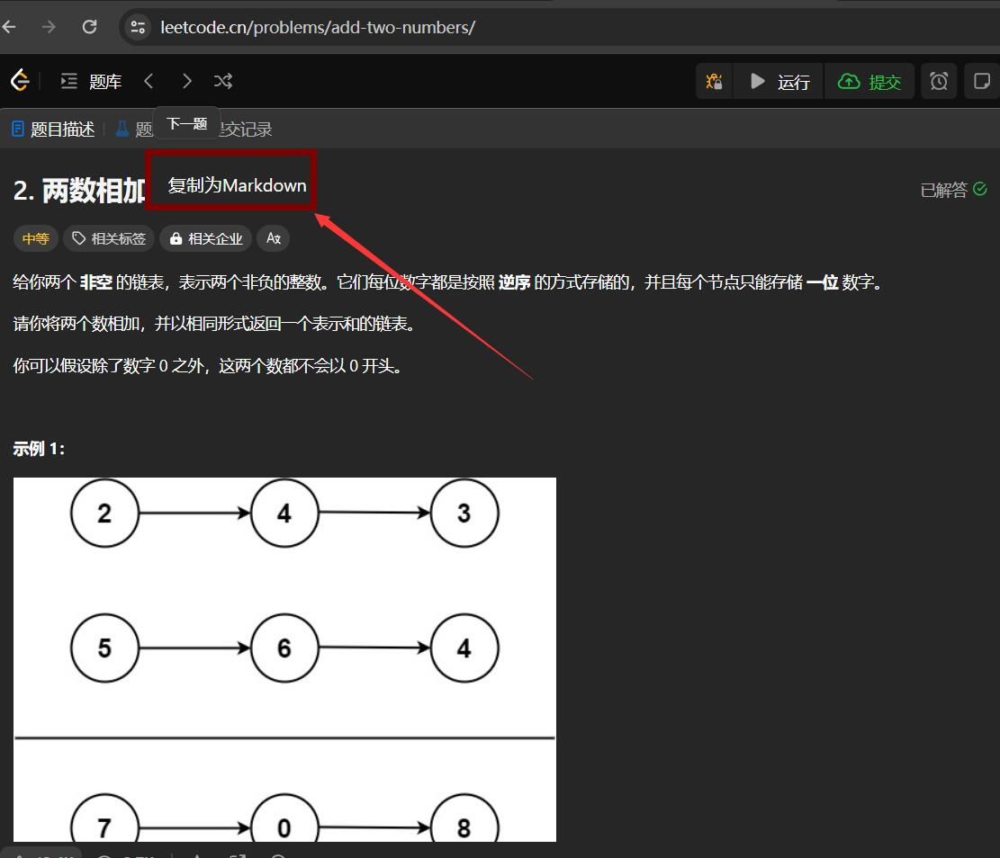

# leetcode2md
## 功能:
- 将Leetcode题目转为markdown格式
## 使用
[油猴安装地址](https://greasyfork.org/zh-CN/scripts/486822-leetcode%E9%A2%98%E7%9B%AE%E8%BD%ACmarkdown)

## 截图:
- 原题目

- 转化后:
```
# 2. 两数相加
给你两个 **非空** 的链表，表示两个非负的整数。它们每位数字都是按照 **逆序** 的方式存储的，并且每个节点只能存储 **一位** 数字。

请你将两个数相加，并以相同形式返回一个表示和的链表。

你可以假设除了数字 0 之外，这两个数都不会以 0 开头。

 

**示例 1：**


```
**输入：**l1 = [2,4,3], l2 = [5,6,4]
**输出：**[7,0,8]
**解释：**342 + 465 = 807.
```

**示例 2：**

```
**输入：**l1 = [0], l2 = [0]
**输出：**[0]
```

**示例 3：**

```
**输入：**l1 = [9,9,9,9,9,9,9], l2 = [9,9,9,9]
**输出：**[8,9,9,9,0,0,0,1]
```

 

**提示：**
- 每个链表中的节点数在范围 `[1, 100]` 内
- `0 &lt;= Node.val &lt;= 9`
- 题目数据保证列表表示的数字不含前导零
```z